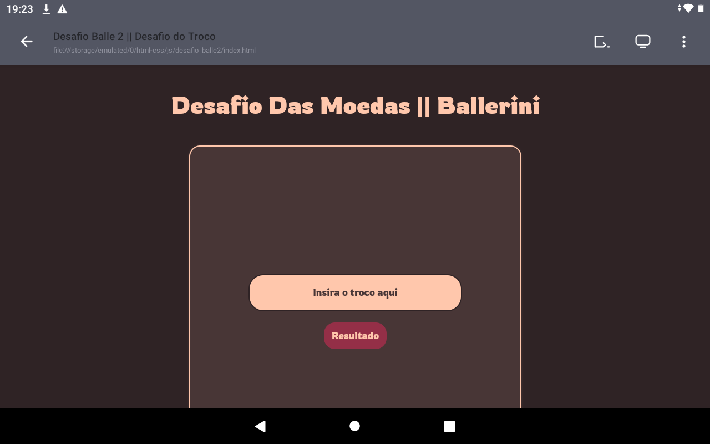

# desafio_balle2
Desafio elaborado na comunidade do Discord criada pela Rafaela Ballerini.

## Olá. tudo bom?
Neste desafio eu procurei fazer algo próximo do “tradicional” na comunidade, trazendo ao CSS cores que muitos deles estou usando somente para “ficar na moda” 🤡

### Só Lembrando...
Você pode experimentar esse site em: <https://emilsonfilho.github.io/desafio_balle2/>

Esse exercício foi *bem* mais complicado que o anterior — tanto que ultrapassou 100 linhas de script — e em vários momentos eu tive que ir debugando o código inteiro somente para saber o que fazer em seguida. Mas no fim, tudo valeu a pena 😉

Procurei trazer algo mais próximo da realidade, colocando infinitas possibilidades como troco e não somente me atendo a números naturais (0, 1, 2, 3...), também como sempre trazendo consigo a validação das áreas de interação e tudo isso *totalmente com JavaScript puro* (por isso que deu trabalho 😅)

No mais, espero que tu experimentes esse site que foi feito com tanta dedicação!

### **Feito com 🤍 por <a href="https://github.com/emilsonfilho/">Emilson Filho</a>**
